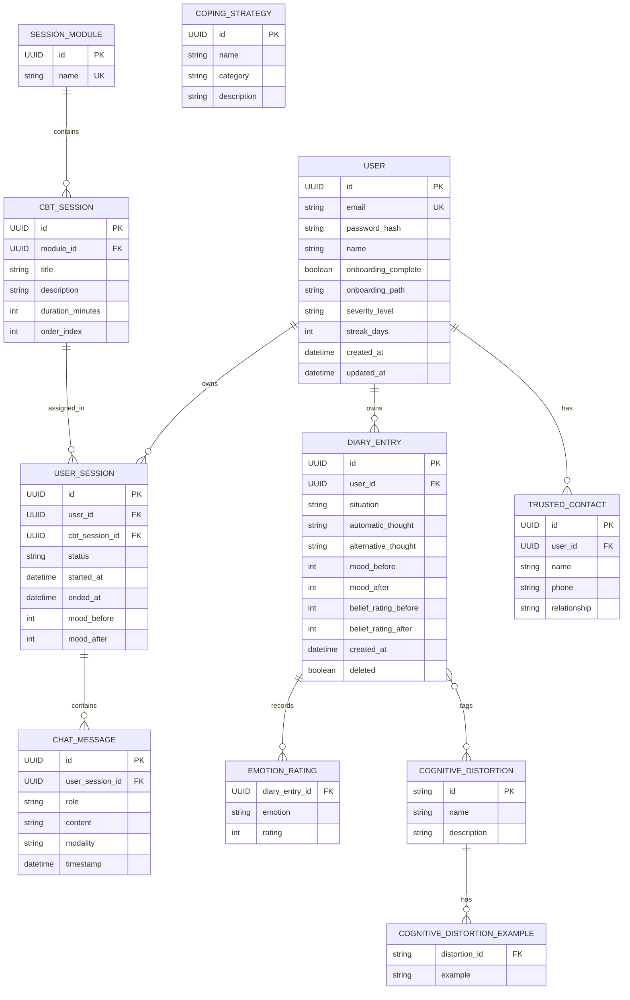

# Entity Relationship Diagram (ERD)

```mermaid
erDiagram
    USER {
        UUID id PK
        string email UK
        string password_hash
        string name
        boolean onboarding_complete
        string onboarding_path
        string severity_level
        int streak_days
        datetime created_at
        datetime updated_at
    }

    SESSION_MODULE {
        UUID id PK
        string name UK
    }

    CBT_SESSION {
        UUID id PK
        UUID module_id FK
        string title
        string description
        int duration_minutes
        int order_index
    }

    USER_SESSION {
        UUID id PK
        UUID user_id FK
        UUID cbt_session_id FK
        string status
        datetime started_at
        datetime ended_at
        int mood_before
        int mood_after
    }

    CHAT_MESSAGE {
        UUID id PK
        UUID user_session_id FK
        string role
        string content
        string modality
        datetime timestamp
    }

    DIARY_ENTRY {
        UUID id PK
        UUID user_id FK
        string situation
        string automatic_thought
        string alternative_thought
        int mood_before
        int mood_after
        int belief_rating_before
        int belief_rating_after
        datetime created_at
        boolean deleted
    }

    EMOTION_RATING {
        UUID diary_entry_id FK
        string emotion
        int rating
    }

    COGNITIVE_DISTORTION {
        string id PK
        string name
        string description
    }

    COGNITIVE_DISTORTION_EXAMPLE {
        string distortion_id FK
        string example
    }

    TRUSTED_CONTACT {
        UUID id PK
        UUID user_id FK
        string name
        string phone
        string relationship
    }

    COPING_STRATEGY {
        UUID id PK
        string name
        string category
        string description
    }

    USER ||--o{ USER_SESSION : owns
    USER ||--o{ DIARY_ENTRY : owns
    USER ||--o{ TRUSTED_CONTACT : has
    SESSION_MODULE ||--o{ CBT_SESSION : contains
    CBT_SESSION ||--o{ USER_SESSION : assigned_in
    USER_SESSION ||--o{ CHAT_MESSAGE : contains
    DIARY_ENTRY ||--o{ EMOTION_RATING : records
    DIARY_ENTRY }o--o{ COGNITIVE_DISTORTION : tags
    COGNITIVE_DISTORTION ||--o{ COGNITIVE_DISTORTION_EXAMPLE : has
```
